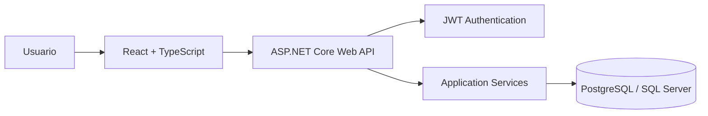
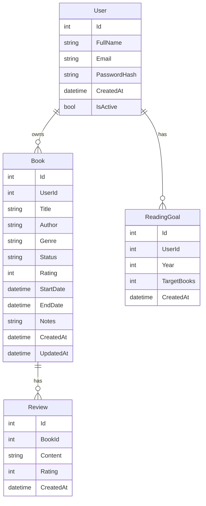
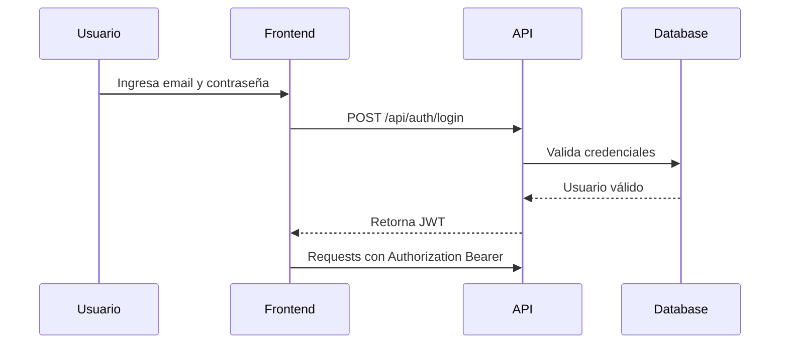
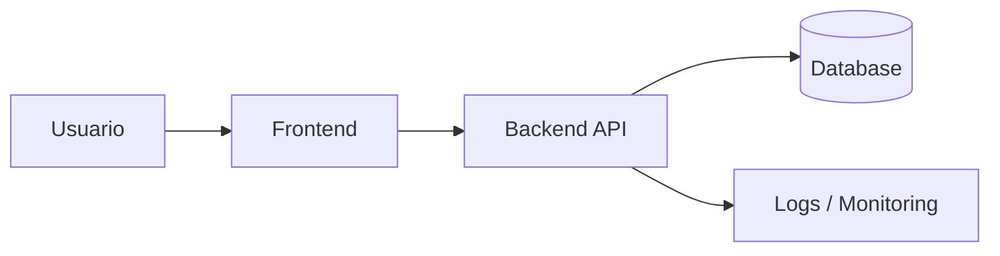

# BookTracker

BookTracker es una aplicación web full-stack para registrar, organizar y analizar libros leídos. Permite a los usuarios crear una cuenta, iniciar sesión, agregar libros a su biblioteca personal, calificarlos, registrar su estado de lectura y visualizar métricas de progreso.

Este proyecto fue creado como una demostración práctica de conocimientos en desarrollo full-stack moderno, arquitectura backend, diseño de APIs REST, autenticación segura, frontend profesional, base de datos relacional, buenas prácticas de código y despliegue cloud.

---

## Características principales

- Registro e inicio de sesión de usuarios.
- Autenticación con JWT.
- Rutas privadas protegidas.
- CRUD de libros.
- Estados de lectura:
  - Pendiente
  - Leyendo
  - Leído
  - Abandonado
- Calificación de libros.
- Notas y reseñas personales.
- Dashboard con métricas de lectura.
- Filtros por título, autor, género y estado.
- Diseño responsive.
- Validaciones en frontend y backend.
- Documentación de API con Swagger.
- Arquitectura preparada para escalar.

---

## Stack tecnológico

### Frontend

- React
- TypeScript
- Tailwind CSS
- React Router
- Axios
- React Hook Form
- Zod

### Backend

- .NET 8
- ASP.NET Core Web API
- Entity Framework Core
- JWT Authentication
- FluentValidation
- AutoMapper
- Swagger / OpenAPI

### Base de datos

- PostgreSQL o SQL Server
- Entity Framework Core Migrations

### DevOps y herramientas

- Git
- GitHub
- Docker
- Docker Compose
- GitHub Actions
- Vercel / Netlify
- Azure App Service / Render

---

## Arquitectura general



El sistema está dividido en tres partes principales:

1. **Frontend:** aplicación web construida con React y TypeScript.
2. **Backend:** API REST construida con ASP.NET Core.
3. **Base de datos:** almacenamiento relacional para usuarios, libros, reseñas y objetivos de lectura.

---

## Estructura del proyecto

```txt
booktracker
│
├── frontend
│   ├── src
│   │   ├── api
│   │   ├── components
│   │   ├── features
│   │   ├── hooks
│   │   ├── routes
│   │   ├── types
│   │   └── utils
│   │
│   └── package.json
│
├── backend
│   ├── BookTracker.Api
│   ├── BookTracker.Application
│   ├── BookTracker.Domain
│   └── BookTracker.Infrastructure
│
├── docker-compose.yml
└── README.md
```

---

## Arquitectura backend

```txt
BookTracker.Api
│
├── Controllers
├── Middlewares
├── Extensions
└── Program.cs

BookTracker.Application
│
├── DTOs
├── Interfaces
├── Services
└── Validators

BookTracker.Domain
│
├── Entities
└── Enums

BookTracker.Infrastructure
│
├── Data
├── Repositories
├── Security
└── Migrations
```

### Principios aplicados

- Separación por capas.
- Inyección de dependencias.
- DTOs para entrada y salida de datos.
- Repositories para acceso a datos.
- Servicios para lógica de negocio.
- Validaciones centralizadas.
- Manejo global de errores.
- Autenticación basada en JWT.
- Documentación con Swagger.

---

## Modelo de datos



---

## Módulos del sistema

### Autenticación

Permite registrar usuarios, iniciar sesión y proteger rutas privadas.

Funcionalidades:

- Registro de usuario.
- Login.
- Generación de JWT.
- Validación de credenciales.
- Protección de endpoints privados.
- Obtención del usuario autenticado.

---

### Biblioteca

Permite gestionar los libros de cada usuario.

Funcionalidades:

- Listar libros.
- Crear libro.
- Editar libro.
- Eliminar libro.
- Ver detalle de libro.
- Filtrar libros por estado, título, autor o género.

---

### Dashboard

Permite visualizar métricas personales de lectura.

Funcionalidades:

- Total de libros registrados.
- Total de libros leídos.
- Total de libros pendientes.
- Promedio de calificación.
- Libros por estado.
- Últimos libros agregados.
- Progreso anual de lectura.

---

### Perfil de usuario

Permite gestionar la información básica del usuario.

Funcionalidades:

- Ver datos del perfil.
- Actualizar información personal.
- Cambiar contraseña.

---

## Seguridad

La autenticación se realiza mediante JWT.



Medidas implementadas:

- Contraseñas hasheadas.
- Tokens JWT con expiración.
- Endpoints protegidos.
- Validación de ownership.
- Un usuario solo puede acceder a sus propios libros.
- Validaciones en frontend y backend.
- Manejo seguro de errores.

---

## API REST

### Auth

| Método | Endpoint | Descripción | Auth |
|---|---|---|---|
| POST | `/api/auth/register` | Registrar usuario | No |
| POST | `/api/auth/login` | Iniciar sesión | No |
| GET | `/api/auth/me` | Obtener usuario autenticado | Sí |

---

### Books

| Método | Endpoint | Descripción | Auth |
|---|---|---|---|
| GET | `/api/books` | Listar libros del usuario | Sí |
| GET | `/api/books/{id}` | Obtener libro por ID | Sí |
| POST | `/api/books` | Crear libro | Sí |
| PUT | `/api/books/{id}` | Actualizar libro | Sí |
| DELETE | `/api/books/{id}` | Eliminar libro | Sí |

---

### Dashboard

| Método | Endpoint | Descripción | Auth |
|---|---|---|---|
| GET | `/api/dashboard/summary` | Obtener resumen general | Sí |
| GET | `/api/dashboard/books-by-status` | Obtener libros por estado | Sí |
| GET | `/api/dashboard/reading-progress` | Obtener progreso de lectura | Sí |

---

## Ejemplo de request

### Crear libro

```http
POST /api/books
Authorization: Bearer {token}
Content-Type: application/json
```

```json
{
  "title": "Clean Architecture",
  "author": "Robert C. Martin",
  "genre": "Software Engineering",
  "status": "Reading",
  "rating": 5,
  "startDate": "2026-04-30",
  "notes": "Libro clave para mejorar diseño de software."
}
```

### Respuesta

```json
{
  "id": 1,
  "title": "Clean Architecture",
  "author": "Robert C. Martin",
  "genre": "Software Engineering",
  "status": "Reading",
  "rating": 5,
  "startDate": "2026-04-30",
  "endDate": null,
  "notes": "Libro clave para mejorar diseño de software.",
  "createdAt": "2026-04-30T10:00:00"
}
```

---

## Instalación local

### Requisitos previos

- Node.js 20+
- .NET 8 SDK
- PostgreSQL o SQL Server
- Git
- Docker opcional

---

### 1. Clonar el repositorio

```bash
git clone https://github.com/your-user/booktracker.git
cd booktracker
```

---

### 2. Configurar backend

```bash
cd backend
dotnet restore
dotnet ef database update
dotnet run
```

La API estará disponible en:

```txt
https://localhost:5001
http://localhost:5000
```

Swagger estará disponible en:

```txt
https://localhost:5001/swagger
```

---

### 3. Configurar frontend

```bash
cd frontend
npm install
npm run dev
```

La aplicación estará disponible en:

```txt
http://localhost:5173
```

---

## Variables de entorno

### Backend

Archivo recomendado:

```txt
backend/BookTracker.Api/appsettings.Development.json
```

Ejemplo:

```json
{
  "ConnectionStrings": {
    "DefaultConnection": "Host=localhost;Database=booktracker;Username=postgres;Password=your_password"
  },
  "Jwt": {
    "Key": "your-super-secret-key",
    "Issuer": "BookTracker",
    "Audience": "BookTrackerUsers",
    "ExpirationMinutes": 60
  }
}
```

---

### Frontend

Archivo recomendado:

```txt
frontend/.env
```

Ejemplo:

```env
VITE_API_URL=https://localhost:5001/api
```

---

## Docker

El proyecto puede ejecutarse usando Docker Compose.

```bash
docker-compose up --build
```

Ejemplo de servicios:

```yaml
version: "3.9"

services:
  database:
    image: postgres:16
    container_name: booktracker-db
    environment:
      POSTGRES_DB: booktracker
      POSTGRES_USER: postgres
      POSTGRES_PASSWORD: postgres
    ports:
      - "5432:5432"

  backend:
    build: ./backend
    container_name: booktracker-api
    ports:
      - "5000:8080"
    depends_on:
      - database

  frontend:
    build: ./frontend
    container_name: booktracker-web
    ports:
      - "5173:80"
    depends_on:
      - backend
```

---

## Testing

### Backend

Pruebas consideradas:

- Unit tests para servicios.
- Integration tests para endpoints.
- Tests de validaciones.
- Tests de lógica de negocio.
- Tests de autorización.

Ejecutar pruebas:

```bash
dotnet test
```

---

### Frontend

Pruebas consideradas:

- Renderizado de componentes.
- Formularios.
- Rutas protegidas.
- Estados de carga.
- Estados de error.

Ejecutar pruebas:

```bash
npm run test
```

---

## Despliegue

### Frontend

Opciones recomendadas:

- Vercel
- Netlify
- Azure Static Web Apps

### Backend

Opciones recomendadas:

- Azure App Service
- Render
- Railway
- Azure Container Apps

### Base de datos

Opciones recomendadas:

- Azure SQL
- PostgreSQL en Render
- Supabase
- Neon

Arquitectura cloud sugerida:



---

## Roadmap

### Versión 1.0

- Registro de usuarios.
- Inicio de sesión.
- CRUD de libros.
- Estados de lectura.
- Calificaciones.
- Notas personales.
- Dashboard básico.

### Versión 1.1

- Filtros avanzados.
- Paginación.
- Ordenamiento.
- Modo oscuro.
- Exportación a Excel.
- Mejoras visuales.

### Versión 1.2

- Objetivos anuales de lectura.
- Estadísticas mensuales.
- Gráficos de progreso.
- Historial de lectura.
- Perfil de usuario mejorado.

### Versión 2.0

- Integración con Google Books API.
- Recomendaciones inteligentes.
- Perfil público de lector.
- Sistema de seguidores.
- IA para resumir notas personales.

---

## Capturas de pantalla

### Login


### Dashboard


### Biblioteca


### Detalle de libro


---

## Decisiones técnicas

### ¿Por qué React + TypeScript?

React permite construir interfaces dinámicas y reutilizables. TypeScript mejora la mantenibilidad del proyecto al reducir errores en tiempo de desarrollo mediante tipado estático.

### ¿Por qué .NET 8?

.NET 8 ofrece buen rendimiento, soporte moderno para APIs REST, integración con Entity Framework Core y una estructura sólida para aplicaciones empresariales.

### ¿Por qué JWT?

JWT permite implementar autenticación stateless, ideal para aplicaciones donde el frontend y backend están separados.

### ¿Por qué una base de datos relacional?

El dominio del proyecto tiene relaciones claras entre usuarios, libros, reseñas y objetivos de lectura. Una base relacional permite mantener integridad, consistencia y consultas estructuradas.

---

## Buenas prácticas aplicadas

- Separación de responsabilidades.
- Código modular.
- Validaciones en frontend y backend.
- Manejo centralizado de errores.
- Endpoints protegidos.
- DTOs para evitar exponer entidades internas.
- Uso de migraciones.
- Documentación de API.
- Tipado estricto en frontend.
- Arquitectura preparada para crecimiento.

---

## Aprendizajes técnicos demostrados

Este proyecto demuestra conocimientos en:

- Desarrollo frontend con React y TypeScript.
- Diseño de interfaces responsive.
- Consumo de APIs REST.
- Manejo de autenticación con JWT.
- Construcción de APIs con ASP.NET Core.
- Entity Framework Core.
- Diseño de base de datos relacional.
- Separación por capas.
- Validaciones con FluentValidation y Zod.
- Dockerización.
- Testing.
- Documentación técnica.
- Despliegue cloud.
- Buenas prácticas de arquitectura de software.

---

## Autor

Desarrollado por Sergio Escalante Gonzales.

Full-Stack Developer especializado en:

- C# / .NET
- React / TypeScript
- SQL Server / PostgreSQL
- Python
- APIs REST
- Automatización de procesos
- Arquitectura de software
- Soluciones cloud

---

## Licencia

Este proyecto fue desarrollado con fines educativos y de portafolio profesional.

El código fuente se encuentra disponible públicamente para revisión, pero no se concede permiso explícito para su uso comercial, redistribución o modificación sin autorización del autor.
